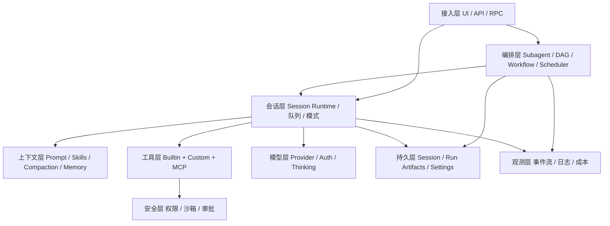

# 基于 Pi SDK 构建完整 Agent 应用 — 可行性文档

| 项 | 内容 |
|---|---|
| 项目 | zuu（Hono + `@earendil-works/pi-coding-agent`） |
| 文档类型 | 可行性分析 / 能力调研 |
| 依据 | [Pi SDK](https://pi.dev/docs/latest/sdk)、[Packages](https://pi.dev/docs/latest/packages)、生态包（`pi-workflow` / `pi-crew` / `pi-subagent` 等）；业界 harness 实践 |
| 结论摘要 | **可行**。完整栈 = **Daemon（HTTP，嵌入 Pi SDK + Packages）** + **Client SDK（唯一对外能力面）** + **多端 UI**；编排装生态包；**Cron/定时任务由 Daemon 常驻承载**（经 Client 管理）。 |

---

## 1. 背景与目标

当前仓库已有：

- `src/index.ts`：Hono 占位服务
- `src/pi-agent.ts`：最小 SDK 调用（`ModelRuntime` + `createAgentSession` + 文本流订阅）

目标：基于 Pi SDK + **Pi Packages**，做成 **Daemon + Client + 多端 UI** 的可演进 Agent 平台。本文回答：

1. 完整 Agent 应具备哪些能力（含 subagent / DAG / workflow / 调度器）？
2. 哪些在 SDK 核心、生态包、Daemon、Client？
3. 如何分阶段落地，并保证后续 TUI / Web / Desktop / 第三方应用共用同一 Client？

> **Pi 官方立场**：核心 minimal，sub-agents 等靠 Packages。  
> **zuu 产品立场**：UI **不直连** Daemon HTTP；一律经 **Client 层**；Client 可独立 SDK 化，Daemon 进程在即可被任意应用集成。

---

## 2. 调研结论：完整 Agent 应用的能力模型

完整应用 = **单 Agent 内核** + **多 Agent 编排** + **应用壳**。可拆为 **9 层**（编排层从「可有」升为完整应用的一等公民）。

### 2.1 能力总览



### 2.2 分层明细与优先级

| 层级 | 必备能力 | 建议优先级 | 来源 |
|---|---|---|---|
| **模型与认证** | 多 Provider、API Key/OAuth、thinking level | P0 | SDK：`ModelRuntime` |
| **Agent 循环** | prompt / steer / followUp、流式事件、abort | P0 | SDK：`AgentSession` |
| **工具系统** | 读写/bash、自定义工具、白名单 | P0 | SDK + Extensions |
| **会话管理** | JSONL 持久化、resume/fork、树形分支 | P0 | SDK：`SessionManager` / Runtime |
| **多 Agent 编排** | Subagent、并行/链式、Orchestrator、DAG、Workflow | **P0–P1** | **生态包**（见 §3.2） |
| **Cron / 定时任务** | cron / interval / one-shot；Daemon 常驻触发；Client 管理 | **P0–P1** | 生态：`pi-crew`；产品：Daemon runner + Client |
| **上下文工程** | System prompt、AGENTS.md、Skills、Compaction | P0–P1 | SDK ResourceLoader |
| **扩展与插件** | Packages 安装、Extensions、事件总线 | P0 | `pi install` + ResourceLoader |
| **安全与权限** | 危险命令确认、路径保护、子进程隔离策略 | P1 | Extension / 编排包内置策略 |
| **接入 / 集成面** | **Client SDK**（包装 Daemon）→ WebUI / TUI / Desktop / 第三方 | **P0** | 自建 Client；UI 禁止裸调 HTTP |
| **人机协同** | ask/confirm、Plan→Build、steer | P1 | Extension `ctx.ui` + Web 协议 |
| **记忆与产物** | run artifacts、workflow board、跨会话交接 | P1 | 编排包（`.pi/workflows`、`.crew/` 等） |
| **观测与运维** | run 状态、健康分、metrics | P1–P2 | 编排包 + 应用层聚合 |

### 2.3 编排层能力清单（完整 Agent 应有）

| 能力 | 含义 | 典型生态实现 |
|---|---|---|
| **Subagent** | 独立 Pi 子进程/会话执行子任务，结果回传主会话 | `@agwab/pi-subagent`、`pi-crew` 子 worker |
| **调度模式** | single / parallel / chain / orchestrator / pool | `pi-subagent` 系；`pi-crew` team |
| **Workflow** | 可命名、可复用的多阶段流程 + 产物传递 + 可 resume | `@agwab/pi-workflow`（`/workflow`） |
| **DAG** | 依赖就绪调度、并行波次、环检测；嵌套 graph | `pi-workflow` 的 `dag` stage；`pi-crew` topology；`pi-dynamic-workflows` DAG scheduler |
| **Fan-out / Fan-in** | foreach 拆分、reduce 汇总、bounded loop | `pi-workflow`：`foreach` / `reduce` / `loop` |
| **Dynamic 编排** | 代码/控制器动态 `ctx.agent()` 建任务 | `pi-workflow` `dynamic`；`pi-crew` `.dwf.ts` |
| **Cron / Scheduler** | cron 表达式、interval、one-shot；到期触发 workflow/agent 任务；可查/停/删 | 生态：`pi-crew` `schedule`/`scheduled`；**产品面：Daemon 托管 + Client CRUD** |
| **隔离** | worktree、`--no-extensions`、只读工具集 | 多数编排包内置选项 |
| **执行路由** | 直接做 / 单 subagent / 已有 workflow / 新建 workflow | `pi-workflow` 的 `execution-router` skill |

### 2.4 业界 + Pi 生态共识

1. **核心 minimal，编排用包**：不要在 zuu 里重写 DAG 引擎；选型安装生态包，应用层做桥接。
2. **Harness > Model**：长任务靠会话、compaction、审批与编排状态机。
3. **Run / Artifact 是编排真相源**：workflow run 记录与 session JSONL 并列重要。
4. **工具可治理 + 子 Agent 权限更严**：子进程常默认收紧 extensions/tools。
5. **引擎与客户端分离**：编排事件经 Daemon→Client 映射到各端 UI（board / 进度 / 审批）。

---

## 3. 能力来源三分法：SDK / 生态包 / 自建

### 3.1 SDK 核心（单 Agent harness）

| 模块 | 关键 API | 价值 |
|---|---|---|
| 会话工厂 | `createAgentSession` / `createAgentSessionRuntime` | 单会话与替换（new/resume/fork） |
| 运行时 | `prompt` / `steer` / `followUp` / `subscribe` / `abort` / `compact` | 交互与流式 |
| 模型 | `ModelRuntime`、thinking level | 多模型 |
| 工具 | builtin + `customTools` | Coding 基线 |
| 资源加载 | `DefaultResourceLoader`（**含 packages 发现**） | 加载生态扩展/skills |
| 设置 | `SettingsManager`（`packages` 列表） | 安装清单持久化 |
| 运行模式 | Interactive / Print / RPC | CLI/批处理/跨语言 |

### 3.2 Pi Packages 生态（多 Agent / DAG / Workflow / Scheduler）

官方明确：**No built-in sub-agents** → 装包。与「完整复杂 Agent」强相关的包：

| 包 | 角色 | 关键能力 |
|---|---|---|
| [@agwab/pi-subagent](https://pi.dev/packages/@agwab/pi-subagent) | Subagent 运行时 | 启动/跟踪 Pi 子 worker（workflow 依赖） |
| [@agwab/pi-workflow](https://pi.dev/packages/@agwab/pi-workflow) | **推荐主编排** | `/workflow`；stage：`single` / `foreach` / `reduce` / `loop` / **`dag`** / `dynamic`；board；resume；bundled deep-research/review |
| [pi-crew](https://pi.dev/packages/pi-crew) | 团队编排 + **调度器** | `team` 工具；并行 phase；worktree；**cron/interval/one-shot schedule**；`.dwf.ts` dynamic workflow；goal loop；topology advisory（含 complex-dag） |
| [pi-dynamic-workflows-oc-style](https://pi.dev/packages/pi-dynamic-workflows-oc-style) | 重型动态工作流 | fan-out（parallel/pipeline/**dag**）、model routing、issue-delivery 闭环 |
| 其他（如 dorkestrator、社区 subagent 扩展） | 备选 | YAML swarm、interview→plan→orchestrate |

**选型建议（zuu）**：

1. **默认栈**：`@agwab/pi-workflow`（含 subagent + DAG + workflow board）作为编排主路径。  
2. **Cron / 定时任务为完整产品必备**：加装 `pi-crew`（或等价 schedule 扩展），由 **Daemon 进程常驻**执行；不依赖某个 UI 开着。  
3. **不要自研 DAG/cron 引擎**（除非生态包无法嵌入）；产品层只做协议与 Client 封装。

安装方式（项目级，可进仓库 settings）：

```bash
pi install -l npm:@agwab/pi-workflow
# 可选
pi install -l npm:pi-crew
```

SDK 侧通过 `DefaultResourceLoader` + 项目 `.pi/settings.json` 的 `packages` 自动加载；**Daemon** 需保证 **cwd / agentDir / settings** 与 CLI 一致，否则扩展不会进会话。

### 3.3 自建分层：Daemon / Client / UI（产品架构）

| 层 | 职责 | 技术 | 谁调用谁 |
|---|---|---|---|
| **Daemon** | 常驻进程；持有 Pi Runtime、packages、会话/workflow 真相源；**托管 cron 调度器**；暴露稳定 **HTTP + SSE 协议** | Hono（Bun） | 仅被 Client 调用 |
| **Client** | 类型化封装：会话、prompt、steer、abort、审批、workflow、**schedules（cron）**、事件订阅；连接/重连 | 先 monorepo，后独立 npm SDK | **所有 UI / 第三方唯一入口** |
| **UI** | WebUI / TUI / Desktop / IDE 插件等纯展示与交互 | 各端自选 | **只依赖 Client** |

原则：

1. **UI 不直接 `fetch` Daemon**（调试除外）；业务代码只调 `ZuuClient`。
2. **Daemon 不嵌入 UI**；Pi SDK 与 **cron 触发**只活在 Daemon 进程内（UI 关掉，定时任务仍跑）。
3. **Client 可 SDK 化**：Daemon 在即可被任意应用集成（含创建/管理 cron job）。
4. 协议版本化（`/v1/...`）；Client 跟协议走。

### 3.4 仍属 Daemon/Client 缺口（相对 Pi）

| 缺口 | 落在哪一层 |
|---|---|
| HTTP 会话/workflow/审批 API | Daemon |
| **Cron job CRUD + 下次触发时间 + 运行历史** | Daemon（调度循环在进程内）；Client 暴露 API |
| SSE 事件规范化 DTO | Daemon 产出，Client 解析 |
| 连接、重试、流式订阅 API | Client |
| 多用户鉴权 token | Daemon 校验，Client 携带 |
| 审批 UX | UI 发起，经 Client → Daemon |
| Windows / WSL 运行约束 | Daemon 部署文档 |

### 3.5 与现有 zuu 代码的差距

| 现状 | 目标态 |
|---|---|
| `pi-agent.ts` 脚本直调 Pi SDK | **仅 Daemon** 内嵌 Pi SDK |
| `index.ts` 占位 Hello | Daemon HTTP 协议 |
| 无 Client | `packages/client`（或 `src/client`）类型化 API |
| 无 UI 边界 | Web/TUI 只 import Client |
| 无 packages | Daemon 的 `.pi/settings.json` 加载 workflow 等 |

---

## 4. 建议产品形态

**定位**：以 Pi 为内核的 **本机/自托管 Agent Daemon**；通过 **Client SDK** 向 WebUI、TUI、Desktop 及第三方应用提供统一能力。

**首发场景**：

- 启动 Daemon（绑定工作目录）
- Client 创建/恢复会话；流式对话 + 工具可视化
- 启用 `@agwab/pi-workflow`；board/进度经 Client 暴露
- **Cron**：经 Client 创建定时任务（如每日 deep-review），Daemon 到期触发 workflow/agent
- 首个 UI 走 Client；审批、模型切换、Skills / AGENTS.md

**非目标（v1）**：自研 DAG/cron 引擎；公网多租户 SaaS；UI 直连 HTTP；Daemon 外再嵌 Pi SDK。

---

## 5. 推荐架构（Daemon → Client → UI）

```text
┌──────────────┐  ┌──────────────┐  ┌──────────────┐  ┌────────────────┐
│   WebUI      │  │    TUI       │  │   Desktop    │  │ 第三方应用集成  │
└──────┬───────┘  └──────┬───────┘  └──────┬───────┘  └────────┬───────┘
       │                 │                 │                   │
       └─────────────────┴────────┬────────┴───────────────────┘
                                  │  只依赖 Zuu Client SDK
                                  ▼
                    ┌─────────────────────────────┐
                    │  zuu-client（Client 层）     │
                    │  sessions / prompt / steer   │
                    │  events.subscribe()          │
                    │  workflows / approvals       │
                    │  schedules (cron/interval)   │
                    │  连接、重连、协议版本        │
                    └──────────────┬──────────────┘
                                   │  HTTP + SSE（稳定协议 /v1）
                                   ▼
                    ┌─────────────────────────────┐
                    │  zuu-daemon（Daemon 层）     │
                    │  Hono：协议适配，无 UI       │
                    │  AgentService + Runtime      │
                    │  Packages（workflow/crew…）  │
                    │  Cron runner（常驻调度循环） │
                    └──────────────┬──────────────┘
                                   │  in-process Pi SDK
                                   ▼
                    AgentSessionRuntime + ResourceLoader
                         │                    │
                         ▼                    ▼
                   LLM / tools          child Pi subagents
                         └────────┬───────────┘
                                  ▼
              Session JSONL + workflow artifacts + schedule store
```

**关键设计决策**：

1. **三层分离**：Daemon 持状态与 Pi；Client 持协议与 DX；UI 持交互。
2. **Client 是唯一集成面**：Daemon 存活即可被任意应用调用（含 cron 管理）。
3. **编排用包**：DAG/workflow 不自研；**cron 执行循环必须在 Daemon**（UI 关闭也要触发）。
4. **Cron 与 Daemon 绑定**：定时任务是选 Daemon 架构的核心理由之一；job 定义持久化，进程重启后恢复调度。
5. **双真相源**：session JSONL + workflow artifacts + **schedule 定义/运行历史**。
6. **与 Pi RPC**：zuu 默认自有 HTTP + Client；Daemon 内可桥接 pi-crew schedule。
7. **平台**：Win 上 workflow/crew 优先 WSL2。

**Client SDK 表面（示意）**：

```ts
const client = createZuuClient({ baseUrl: "http://127.0.0.1:8787", token });

const session = await client.sessions.create({ cwd });
const unsub = client.sessions.subscribe(session.id, (ev) => { /* DTO */ });
await client.sessions.prompt(session.id, { text: "..." });
await client.sessions.steer(session.id, { text: "..." });
await client.approvals.resolve(id, { allow: true });
const runs = await client.workflows.list(session.id);

// Cron / 定时任务（经 Client，不经 UI 直连）
const job = await client.schedules.create({
  name: "daily-deep-review",
  cron: "0 9 * * 1-5",          // 或 intervalMs / runAt
  action: { type: "workflow", name: "deep-review", prompt: "Review recent diffs" },
  cwd,
});
await client.schedules.list();
await client.schedules.pause(job.id);
await client.schedules.trigger(job.id); // 手动立即跑一次
await client.schedules.remove(job.id);
```

UI / 第三方只看见上述 API；cron 触发产生的 run/session 事件仍走 `subscribe`。

---

## 6. 功能分期（可行性路线图）

### Phase 0 — Daemon 内核（约 0.5–1 周）

- Daemon 内 `AgentService`：Runtime、持久 Session、事件总线
- 最小 HTTP：`health`、创建会话、prompt、SSE events（可先粗糙）
- **同步落地 `zuu-client` 骨架**（哪怕只有 3 个方法），脚本用 Client 测，不用裸 curl 当长期接口

**退出标准**：经 Client 多轮对话 + resume。

### Phase 1 — Client 成型 + 首个 UI + 编排包（约 1–2 周）

- 固化 `/v1` 协议与 Client 类型
- 装 `@agwab/pi-workflow` + **`pi-crew`（或等价 cron 能力）**；Daemon 加载 packages
- 最小 WebUI **或** TUI：只依赖 Client
- workflow 跑通；Client 暴露 run 状态
- **Cron MVP**：`schedules.create/list/remove` + Daemon 到期触发一次 workflow（可先 interval，再 cron 表达式）

**退出标准**：一端 UI 全走 Client；workflow 成功；**至少一条定时任务自动触发成功**。

### Phase 2 — 多端准备 + 完整能力（约 2–4 周）

- Client：审批、fork、workflow board、steer/followUp、重连
- **Cron 完整化**：cron 表达式、pause/resume、手动 trigger、运行历史、失败重试/告警事件
- 第二端 UI 验证解耦；权限 Extension；自定义 workflow
- Client 收成 `packages/client` 边界

**退出标准**：两套 UI 共用 Client；编排可观察；**定时任务可运维**。

### Phase 3 — Client SDK 化与外部集成（持续）

- 发布 Client SDK；鉴权、配额、第三方示例
- Desktop / 系统服务安装（保证 Daemon 开机自启 → cron 可靠）
- 沙箱、观测、cron 仪表盘

---

## 7. 可行性评估

| 维度 | 评级 | 说明 |
|---|---|---|
| 技术可行性 | **高** | Daemon 嵌 Pi + Packages；Client 包 HTTP 是常规模式 |
| 产品可行性 | **高** | 多端与第三方集成路径清晰 |
| 工程工作量 | **中** | 多一层 Client，但换来 UI/集成解耦；协议要一次设计好 |
| 安全风险 | **中高** | Daemon 本机权限；Client/第三方需鉴权 |
| 依赖风险 | **中高** | 编排包 + 自有协议双依赖 |
| 平台风险 | **中高（Win）** | workflow 包环境约束 |

**总评**：**Go**。架构以 **Daemon + Client** 为轴；UI 可替换；禁止 UI 直连 Daemon 成为惯例。

---

## 8. 主要风险与缓解

| 风险 | 影响 | 缓解 |
|---|---|---|
| UI 绕过 Client 直连 HTTP | 协议分裂、多端不一致 | lint/约定 + 示例只展示 Client |
| 协议破坏性变更 | Client/多端翻车 | `/v1` 版本化；DTO 兼容 |
| Packages 未进 Daemon | 编排/cron「装了却没有」 | 启动 diagnostics |
| **Daemon 未常驻 / 关机** | **cron 不触发** | 文档强调 Daemon 服务化；可选开机自启；错过窗口策略（skip / catch-up） |
| **cron 与 workflow 时区/夏令时** | 跑错点 | 统一存 UTC + 显式 timezone 字段 |
| 子进程/成本失控 | 资源打满 | 限流、concurrency、禁 YOLO |
| Windows 与 pi-workflow/crew | 编排/cron 不可用 | WSL2 或降级 |
| 会话替换丢订阅 | UI 卡死 | Daemon 重绑；Client resubscribe |
| 第三方滥用 Daemon | 安全事故 | token、loopback、可选 mTLS |

---

## 9. 工作量粗估（单人全职）

| 阶段 | 人天 | 产出 |
|---|---|---|
| Phase 0 | 4–6 | Daemon + Client 骨架 |
| Phase 1 | 8–14 | 协议成型、一端 UI、workflow |
| Phase 2 | 10–20 | 第二端 UI、board、Client 包边界 |
| Phase 3 | 持续 | Client SDK 发布、外部集成、加固 |

合计：**约 5–8 周**到「Daemon + Client + 编排 + 至少一端 UI」。

---

## 10. 建议的目录雏形

```text
packages/
  daemon/                  # Hono Daemon（唯一嵌 Pi SDK）
    src/index.ts
    src/agent/
    src/http/v1/
  client/                  # Zuu Client SDK（UI/第三方唯一入口）
    src/index.ts
    src/sessions.ts
    src/workflows.ts
    src/schedules.ts       # cron / interval / one-shot
    src/events.ts
apps/
  web/                     # WebUI → 只依赖 @zuu/client
  tui/                     # 未来 TUI → 只依赖 @zuu/client
.pi/
  settings.json            # Daemon 侧 packages（含 pi-crew 等）
docs/
  feasibility-agent-app.md
  protocol-v1.md           # （后续）HTTP/SSE 契约（含 /schedules）
```

单仓初期也可先 `src/daemon` + `src/client`，再拆 packages。

---

## 11. Go / No-Go 检查清单

- [x] Pi SDK 覆盖单 Agent 内核？→ 是  
- [x] Subagent/DAG/Workflow/Scheduler(cron) 有生态包？→ 是（crew schedule 等）  
- [x] Cron 是否由 Daemon 托管（UI 关掉仍触发）？→ **是**  
- [x] 采用 Daemon + Client + UI 三层？→ **是（产品决策）**  
- [x] UI 是否直连 HTTP？→ **否**  
- [x] Client 是否可 SDK 化供第三方？→ **是（Phase 3）**  
- [ ] 运行环境（WSL/Linux）？→ 需确认  
- [ ] Daemon 鉴权、loopback、开机自启（cron 可靠）？→ 实施前确认  

**决策建议**：Phase 0 起同时建 Daemon 与 Client；Phase 1 起交付 cron MVP。

---

## 12. 参考来源

- Pi SDK：https://pi.dev/docs/latest/sdk  
- Pi Packages / RPC Mode（跨进程集成思路可对照）  
- [@agwab/pi-workflow](https://pi.dev/packages/@agwab/pi-workflow)、[pi-crew](https://pi.dev/packages/pi-crew)  
- 本仓库产品架构决策：Daemon HTTP + Client SDK + 多端 UI  

---

## 13. Pi SDK 文档审查补充

Pi SDK 文档对于“嵌入一个单 Agent 会话”是合理的，已覆盖 `createAgentSession`、`AgentSession`、`ModelRuntime`、`SessionManager`、`SettingsManager`、`DefaultResourceLoader`、自定义工具、扩展、会话持久化、运行模式和 RPC。

但完整 Agent 应用还必须在应用层补齐以下内容：

1. **应用自管状态目录**：嵌入式应用应显式设置 `agentDir`、`SettingsManager`、`ModelRuntime` 的 auth/model 路径，以及 `SessionManager` 的 sessionDir。否则 SDK 默认使用 `~/.pi/agent`，不适合沙箱、便携应用或 daemon 自管状态。
2. **模型可用性不等于调用成功**：`ModelRuntime.getAvailable()` 只能说明认证和模型目录看起来可用，真实 provider stream 仍可能因为网络、代理或服务商错误失败。
3. **错误事件需要应用层映射**：Provider 失败可能表现为 assistant message，其中 `stopReason: "error"` 且带有 `errorMessage`，不一定由 `session.prompt()` 直接抛错。Daemon 必须把这类消息转换为 Client 可见错误事件。
4. **Session replacement 是生命周期边界**：resume、fork、import 等会替换 active session。替换后必须重新订阅事件，并在使用 extensions 时重新绑定。
5. **编排不是 SDK core**：Subagent、Workflow、DAG 和 Scheduler 依赖 Pi Packages 或自建 Adapter。`@agwab/pi-workflow` 更适合作为 workflow/subagent 主路径，`@agwab/pi-subagent` 是更底层 worker 工具，Scheduler 需要 `pi-crew` 或 daemon 托管的独立调度后端。
6. **Package 信任必须产品化**：Pi packages 可以执行代码并影响 Agent 行为，Zuu 应暴露 package 来源、信任状态、启用/禁用状态和诊断信息。
7. **SDK 不定义应用协议**：HTTP/SSE DTO、run ID、重连、取消、背压和错误规则都属于 Zuu 协议层。
8. **Windows 支持边界要前置**：workflow/subagent 相关 package 页面要求 Node.js `>=22.19.0`，支持 macOS/Linux，Windows 建议 WSL2，不应默认承诺原生 Windows 完整支持。
9. **文档与示例存在轻微漂移**：最新 SDK 页面展示了 `customTools` + `defineTool`，但本地 `examples/sdk/05-tools.ts` 仍引导读者去看 extensions 示例，后续实现应以实际安装包类型和编译结果为准。

本次垂直切片验证了其中第 1、2、3、7 点：Zuu 已改为项目内 `.zuu/pi-agent` 存储，诊断接口会暴露 workflow/scheduler 缺口，SSE 映射会将 assistant error 转为客户端错误事件。

---

## 附录 A：完整应用「功能清单」速查

**必须有（P0）**

1. Daemon 常驻 + 健康检查  
2. Client SDK 骨架（会话 / prompt / events）  
3. 模型认证与选择（Daemon 内）  
4. 流式对话（经 Client 订阅）  
5. 工具执行事件展示  
6. 会话持久化与恢复  
7. abort / cwd 绑定  
8. Packages 加载（workflow 等）  
9. Subagent + Workflow/DAG（生态包）  
10. **Cron / 定时任务（Daemon 托管 + Client CRUD）**  
11. **至少一端 UI 且只依赖 Client**  

**应该有（P1）**

12. fork / compaction / Skills / 审批  
13. steer / followUp  
14. Workflow board（经 Client）  
15. Cron：pause/resume、手动 trigger、运行历史、timezone  
16. 第二端 UI（验证解耦）  
17. 协议 `/v1` 文档（含 schedules）  

**可以有（P2）**

18. Client 正式 npm/SDK 化与第三方示例  
19. Desktop / Daemon 开机自启（强化 cron 可靠性）  
20. Dynamic workflow / goal loop  
21. 沙箱、配额、cron/观测仪表盘  

---

*文档版本：v1.3 · 2026-08-11 — Cron/定时任务升为一等能力（Daemon 托管）*
