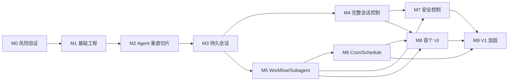

# Zuu Agent Platform 实施计划

> 状态：Proposed  
> 版本：0.1.0  
> 日期：2026-08-11  
> 输入：[Spec](./spec.md) · [可行性分析](./feasibility-agent-app.md)

## 当前实现进展

- 已切换到 Node.js + pnpm 运行链路，环境变量通过 Node 24 原生 `--env-file-if-exists=.env` 读取。
- Daemon 已提供 Project 注册表，并为 sessions、runs、workflow runs、schedules 提供 Project 级 API。
- WebUI 当前优先通过 `@zuu/client` 的 `listProject*` / `createProject*` 方法访问 Project 内资源。
- 全局列表接口保留给诊断、脚本和跨项目汇总；业务 UI 不再依赖全局接口加 `projectId` query 的模式。

## 1. 计划目标

按照 Spec 实现一个可运行、可扩展的 Zuu V1：

```text
UI / 第三方应用
      ↓
@zuu/client
      ↓ HTTP + SSE /v1
zuu-daemon
      ↓
Pi SDK + Pi Packages
```

本计划优先验证架构风险，再扩展产品能力。每个阶段必须满足退出标准，不能以未验证的占位实现进入下一阶段。

## 2. 实施原则

1. **垂直切片优先**：尽早跑通 Client → Daemon → Pi → SSE。
2. **协议先于 UI**：UI 只使用 Client；禁止在 UI 中散落 `fetch`。
3. **协议与实现解耦**：公共 DTO 放在 `@zuu/protocol`，不暴露 Pi/Hono 类型。
4. **先单 Agent，后编排**：先稳定 Session Runtime，再接 Workflow/Subagent。
5. **先手动触发，后 Cron**：先验证 Workflow Adapter，再让 Schedule 触发它。
6. **风险前置**：第一阶段验证 WSL2、Package 加载、Session 恢复和 SSE。
7. **每阶段可运行**：主分支始终能构建、测试和启动。
8. **不自研通用 DAG/Cron 引擎**：通过 Adapter 集成生态实现。

## 3. 里程碑总览

| 里程碑 | 目标 | 核心交付物 | 退出条件 |
|---|---|---|---|
| M0 | 技术风险验证 | Pi/Package/WSL Spike | 关键依赖在目标环境可运行 |
| M1 | 基础工程 | Monorepo、Protocol、CI | 所有包可构建测试 |
| M2 | Agent 垂直切片 | Daemon + Client + Prompt SSE | Client 可完成一轮流式对话 |
| M3 | 持久会话 | Project、Session、SQLite | Daemon 重启后可继续会话 |
| M4 | 完整会话控制 | steer、follow-up、abort、compact、fork | Session 生命周期可控 |
| M5 | Workflow/Subagent | Workflow Adapter、Run/Task/Artifact | 真实 Workflow 与 Subagent 跑通 |
| M6 | Cron/Schedule | Schedule Adapter、持久调度、历史 | UI 关闭时自动触发成功 |
| M7 | 安全控制 | Token、审批、路径保护 | 默认配置不可静默执行高危操作 |
| M8 | 首个 UI | WebUI 或 TUI | UI 仅通过 Client 完成核心流程 |
| M9 | V1 加固 | 可观测、文档、安装与验收 | Spec V1 验收全部通过 |

## 4. 依赖关系



可并行工作：

- M4 与 M5 可在 M3 完成后并行。
- M7 的网络鉴权可与 M5 并行，审批集成等待工具事件稳定。
- M8 可先搭应用壳，但核心页面必须等待对应 Client API。

## 5. M0：技术风险验证

### 5.1 目标

在正式重构前确认 Pi SDK、Pi Packages、Node.js、WSL2 和调度能力能够组合运行。

### 5.2 工作项

#### SPIKE-001：Pi SDK Runtime

- 用 `createAgentSessionRuntime()` 创建持久 Session。
- 验证 prompt、事件订阅、abort 和 dispose。
- 验证 Session 恢复。
- 验证 Runtime 替换后重新订阅。

#### SPIKE-002：Package 加载

- 使用 `DefaultResourceLoader` 加载项目 `.pi/settings.json`。
- 输出 extensions、skills、prompts 和 diagnostics。
- 验证 Package 加载错误可程序化获取。

#### SPIKE-003：Workflow/Subagent

- 在 WSL2 或 Linux 安装固定版本 `@agwab/pi-workflow`。
- 运行 bundled workflow。
- 确认真实 Subagent 被创建。
- 定位 Run、Stage、Task、Artifact 的持久化位置和事件来源。
- 记录 Adapter 所需最小 API。

#### SPIKE-004：Schedule

- 验证 `pi-crew` schedule/interval/one-shot。
- 确认是否能从 SDK Extension Runtime 调用，而非仅依赖交互式 TUI。
- 验证进程重启后的任务恢复。
- 验证触发 Workflow 的可行性。

#### SPIKE-005：运行时兼容

- Node.js 下运行主 Daemon。
- 验证主进程与子 Pi 进程所需 Node.js 版本。
- 验证原生 Windows 与 WSL2 差异。
- 明确开发和生产支持矩阵。

### 5.3 交付物

- `docs/spikes/pi-runtime.md`
- `docs/spikes/pi-workflow.md`
- `docs/spikes/pi-schedule.md`
- 更新 Spec 第 21 节待定决策
- 锁定 Package 版本

### 5.4 退出标准

- Pi Session 可创建、流式输出并恢复。
- 至少一个 Workflow 和 Subagent 成功。
- Schedule 能自动触发至少一次任务。
- 明确 Schedule Backend 选型。
- 明确 Linux/WSL2 运行方式。

若 Schedule 不能通过 `pi-crew` 稳定嵌入，则选择可靠的独立调度库作为 Schedule Backend，但仍通过 Workflow Adapter 执行任务，不自研 cron 解析器。

## 6. M1：基础工程与 Monorepo

### 6.1 目标结构

```text
apps/
  web/                     # 可延后创建
packages/
  protocol/
  daemon/
  client/
docs/
  spec.md
  implementation-plan.md
.pi/
  settings.json
```

### 6.2 工作项

#### ENG-001：Workspace

- 将仓库转换为 workspace，并以 Node.js 作为服务运行时。
- 建立统一 TypeScript 配置。
- 建立 build、typecheck、test、lint 脚本。
- 保留临时兼容入口或迁移 `src/pi-agent.ts`。

#### ENG-002：Protocol 包

- 建立 `@zuu/protocol`。
- 定义通用响应、分页、错误模型。
- 定义 Project、Session、Run、Workflow、Approval、Schedule DTO。
- 定义 `ZuuEvent` 与 V1 事件联合类型。
- 使用运行时 Schema 验证外部输入。

#### ENG-003：Daemon 包

- 建立 Hono 应用与 `/v1` 路由分层。
- 加入配置加载、结构化日志和 graceful shutdown。
- 加入统一错误中间件和 request ID。

#### ENG-004：Client 包

- 建立 `createZuuClient()`。
- 实现 transport、鉴权、timeout 和错误映射。
- Client 只依赖 protocol。

#### ENG-005：测试基础设施

- 单元测试配置。
- Daemon 内存端口集成测试。
- Protocol fixtures。
- 临时数据目录隔离。

### 6.3 退出标准

- 安装依赖后可一次执行 build/typecheck/test。
- Protocol 不依赖 Hono 或 Pi。
- Client 不依赖 Pi。
- Daemon 可启动并返回 `/v1/health`。

## 7. M2：Agent 垂直切片

### 7.1 目标

从 Client 发起 prompt，经 Daemon 调用 Pi，并通过 SSE 收到文本增量和完成事件。

### 7.2 工作项

#### AGENT-001：ModelRuntime Service

- Daemon 启动时创建 `ModelRuntime`。
- 暴露可用模型诊断。
- 支持环境变量和 Pi Credential Store。
- 禁止通过 API 返回密钥。

#### AGENT-002：Agent Runtime Factory

- 封装 `createAgentSessionServices()`。
- 封装 `createAgentSessionFromServices()`。
- 封装 `createAgentSessionRuntime()`。
- 管理 cwd、agentDir、Settings 和 ResourceLoader。

#### AGENT-003：Runtime Registry

- 以 Session ID 管理活动 Runtime。
- 同 Session 互斥。
- LRU 或 idle timeout 释放。
- Daemon 退出时 dispose。

#### API-001：最小 Session API

- 创建 Project。
- 创建内存 Session。
- 提交 prompt。
- 查询 Run。
- abort Run。

#### EVENT-001：事件映射

- 将 Pi agent/message/tool 生命周期映射为 Zuu Event。
- 不透传 Pi 内部类型。
- 为每个事件生成稳定 Event ID。

#### EVENT-002：SSE

- 实现 `/v1/events`。
- 支持 project/session/run 过滤。
- heartbeat。
- Client 订阅、关闭和基础重连。

#### CLIENT-001：最小 SDK

- `health.get()`
- `projects.create()`
- `sessions.create()`
- `sessions.prompt()`
- `runs.abort()`
- `events.subscribe()`

### 7.3 测试

- Client → Daemon → Pi 的真实模型冒烟测试。
- 使用 Fake Agent Backend 的确定性集成测试。
- 文本 delta 顺序正确。
- Run 结束状态唯一。
- abort 后最终状态为 `aborted`。

### 7.4 退出标准

- 业务调用只使用 Client。
- 可完整收到 `run.started → text_delta* → run.completed`。
- Client 断开不会终止 Agent Run。
- Run 可取消。

## 8. M3：Project、持久会话与 Store

### 8.1 工作项

#### STORE-001：SQLite

- 选定 SQLite 驱动和迁移工具。
- 建立 migration runner。
- 建立 Project、Session 映射、Run 索引表。
- 配置 WAL、busy timeout 和事务边界。

#### PROJECT-001：Project API

- Project CRUD。
- cwd 规范化和存在性校验。
- Project 状态与 diagnostics。
- 禁止重复注册同一规范路径，或定义明确别名策略。

#### SESSION-001：持久 Session

- 使用 `SessionManager.create(cwd)`。
- 保存 Zuu Session ID ↔ Pi Session File 映射。
- 列表、命名、删除。
- `continueRecent` 和 open。

#### SESSION-002：恢复

- Daemon 重启后按需加载 Runtime。
- 遗留 running Run 状态修复。
- 重新建立 Session 事件订阅。

### 8.2 退出标准

- Daemon 重启后 Client 能列出原有 Project 和 Session。
- 可继续同一 Pi Session 对话。
- 不活动 Runtime 被释放后仍可重新加载。
- 数据迁移可重复执行。

## 9. M4：完整 Session 控制

### 9.1 工作项

- `steer`
- `followUp`
- `compact`
- `fork`
- Session tree 导航所需最小 API
- model 切换
- thinking level 切换
- queue 状态事件
- auto-retry 与 compaction 事件

### 9.2 并发规则

- 普通 prompt 遇到运行中 Session 返回 `409 session_busy`。
- steer/follow-up 必须显式调用对应 Client 方法。
- compact 与模型切换不能和主 Run 并发。
- Runtime 替换由单一 Session lock 保护。

### 9.3 退出标准

- Client 可控制完整 Session 生命周期。
- fork 产生独立可恢复 Session。
- compact 后继续对话成功。
- 队列状态与错误可观察。

## 10. M5：Workflow、DAG 与 Subagent

### 10.1 工作项

#### WF-001：Workflow Backend 接口

- 实现 Spec 中 `WorkflowBackend`。
- 建立标准 Definition、Run、Stage、Task、Artifact DTO。
- 对 Package 内部格式做隔离。

#### WF-002：Pi Workflow Adapter

- 列出 bundled/project workflows。
- 启动 Workflow。
- 查询 Run/Stage/Task。
- abort。
- 订阅或轮询后端状态，并产生标准事件。

#### WF-003：Artifact

- Artifact 索引。
- 文本/JSON Artifact 读取。
- 大文件分页或下载。
- 防止路径穿越。

#### WF-004：Subagent 限制

- Project 级并发限制。
- 默认最大并发 4。
- 只读任务限制工具。
- 并行编辑启用 worktree 时记录 worktree。
- 子 Agent 默认不继承未授权 Extension。

#### CLIENT-002：Workflow SDK

- `workflows.list()`
- `workflows.run()`
- `workflows.getRun()`
- `workflows.listTasks()`
- `workflows.getArtifact()`
- `workflows.abort()`

### 10.2 退出标准

- Client 可启动真实 bundled Workflow。
- 至少一个 Run 产生多个 Subagent Task。
- DAG 进度可查询。
- Artifact 可读取。
- 失败节点和错误原因可见。

## 11. M6：Cron 与 Schedule

### 11.1 前置决策

根据 M0 结果选定：

- 方案 A：`pi-crew` Schedule Adapter。
- 方案 B：独立可靠 Scheduler + Workflow Adapter。

不论后端如何，对外 API 与 Client 保持不变。

### 11.2 工作项

#### SCHED-001：Schedule Store

- Schedule 表。
- Schedule Run 表。
- trigger、action、timezone、misfire、overlap。
- 索引和运行历史保留策略。

#### SCHED-002：Schedule Backend

- create/update/remove/reconcile/shutdown。
- Daemon 启动恢复。
- Daemon graceful shutdown。
- 所有触发创建 Schedule Run。

#### SCHED-003：触发类型

按顺序实现：

1. one-shot
2. interval
3. cron + timezone

#### SCHED-004：Action

- Prompt Action。
- Workflow Action。
- `new` / `reuse` / `continue_recent` Session Policy。
- 关联 Agent Run 或 Workflow Run。

#### SCHED-005：运行策略

- misfire：skip/run_once。
- overlap：skip/queue/parallel。
- max runtime。
- abort。
- 可选 retry policy。

#### API-002：Schedule API

- CRUD。
- pause/resume。
- trigger now。
- runs/history。
- abort Schedule Run。

#### CLIENT-003：Schedule SDK

- 完整封装 Schedule API。
- 类型化 cron/interval/once。
- 订阅 schedule 事件。

### 11.3 测试矩阵

- UI 和 Client 退出后，Daemon 仍触发。
- Daemon 重启恢复。
- 停机错过触发的 misfire。
- overlap 三种策略。
- timezone 与 DST。
- Workflow 失败时 Schedule Run 失败。
- 手动 trigger 不改变 `nextRunAt`。

### 11.4 退出标准

- Client 创建的 Cron Schedule 可自动触发真实 Workflow。
- Schedule Run 可查询并关联 Workflow Run。
- Daemon 重启后 Schedule 恢复。
- 默认 overlap 为 skip。
- 默认无交互审批时高危操作失败。

## 12. M7：安全与审批

### 12.1 工作项

#### SEC-001：本地鉴权

- 默认 loopback。
- 首次启动生成 token。
- Bearer token 中间件。
- token 文件权限。
- token 轮换。

#### SEC-002：Project Path Guard

- 工具路径规范化。
- 默认 cwd 边界。
- `.env`、SSH、credential 路径保护。
- symlink 越界测试。

#### SEC-003：Tool Approval

- Pi `tool_call` 拦截。
- Approval Store。
- pending/resolve/expire。
- allow once、allow session、deny。
- SSE 事件。

#### SEC-004：无人值守策略

- Schedule 默认不得等待无限审批。
- 无预授权时拒绝危险工具。
- 预授权绑定 Project、工具、命令模式和有效期。

#### SEC-005：Package Trust

- 精确版本。
- Package 来源记录。
- 启动 diagnostics。
- 项目首次信任流程。

### 12.2 退出标准

- 未授权 HTTP 请求被拒绝。
- Project 外写操作默认被阻止。
- 用户可通过 Client 处理 Approval。
- Schedule 不会绕过审批策略。
- 日志和 diagnostics 不泄露密钥。

## 13. M8：首个 UI

### 13.1 建议

优先实现最小 WebUI，因为它能快速验证浏览器 Client、SSE、Workflow Board 和 Schedule 管理。TUI 作为第二端验证 Client 抽象。

### 13.2 页面

- Daemon 状态与 diagnostics
- Project 列表和创建
- Session 列表
- Chat 与流式输出
- Tool Call 与 Approval
- Workflow 列表、Run Board、Task、Artifact
- Schedule 列表、编辑、暂停、立即运行和历史

### 13.3 架构约束

- UI 只能 import `@zuu/client` 和 `@zuu/protocol`。
- UI 源码禁止调用 Daemon `/v1`。
- UI 不读取本地 Pi 文件。
- UI 关闭不影响 Run、Workflow 或 Schedule。

### 13.4 退出标准

- 用户可完成 Spec V1 的主要流程。
- Network 调用均来自 Client Transport。
- SSE 断线重连后状态恢复。
- 刷新页面不会中止后台任务。

## 14. M9：V1 加固与发布

### 14.1 工作项

- 结构化日志与日志脱敏。
- 指标采集。
- 健康、ready、degraded 语义。
- Daemon 服务安装和开机自启。
- 数据迁移与备份。
- Client API 文档。
- 第三方集成示例。
- Linux/WSL2 安装文档。
- 性能和长时间运行测试。
- 完整 V1 验收。

### 14.2 发布门槛

- `docs/spec.md` 第 19 节全部通过。
- 无 P0/P1 已知安全问题。
- Daemon 连续运行测试通过。
- Schedule 重启恢复测试通过。
- Client 契约测试通过。
- 所有依赖固定版本。

## 15. 测试策略

### 15.1 测试层次

```text
Unit
  ↓
Protocol contract
  ↓
Daemon integration (fake backend)
  ↓
Pi integration (real local runtime)
  ↓
Workflow/Subagent end-to-end
  ↓
Schedule restart/endurance
  ↓
UI end-to-end
```

### 15.2 Fake Backend

为了稳定测试，应定义：

- `AgentBackend`
- `WorkflowBackend`
- `ScheduleBackend`

单元和多数集成测试使用 Fake；仅专门测试运行真实 Pi 和第三方 Packages。

### 15.3 必须阻断合并的检查

- format/lint
- typecheck
- unit tests
- protocol contract tests
- daemon/client integration tests
- migration tests

真实模型测试不应阻断每次提交，但必须在发布和依赖升级时运行。

## 16. 数据迁移计划

### 16.1 当前代码迁移

- `src/pi-agent.ts` 作为 M0 Spike 参考，完成 M2 后删除或迁移为 example。
- `src/index.ts` 的 Hono 占位入口迁移到 `packages/daemon`。
- 根 `package.json` 改为 workspace 管理。
- `tsconfig.json` 拆为 base config 和 package configs。

### 16.2 向后兼容

当前项目没有已发布 API 或持久业务数据，因此 M1 可进行一次性结构重组。自 `/v1` 和首个数据库 migration 发布后，后续必须采用兼容迁移。

## 17. 风险登记

| 风险 | 概率 | 影响 | 处理 |
|---|---|---|---|
| Pi Package 仅在 TUI 路径完整工作 | 中 | 高 | M0 提前验证 SDK/Extension 调用路径 |
| `pi-workflow` 不支持原生 Windows | 高 | 中 | 官方支持环境定为 Linux/WSL2 |
| `pi-crew` Schedule 难以稳定嵌入 | 中 | 高 | Schedule Adapter + 备选可靠调度库 |
| Pi 事件随版本变化 | 中 | 高 | Adapter + 固定依赖版本 + 契约测试 |
| SSE 重连丢事件 | 中 | 中 | Event ID、重放窗口、状态补拉 |
| Subagent 资源失控 | 中 | 高 | Project 并发、预算、超时、abort |
| Schedule 无人审批 | 高 | 高 | 默认拒绝 + 有界预授权 |
| Daemon 非正常退出损坏状态 | 低 | 高 | SQLite WAL、事务、启动 reconcile |
| Client 过早锁死错误抽象 | 中 | 中 | 先 internal package，V1 后再发布 |

## 18. 建议的首个迭代

首个迭代只做 M0 + M1，不直接开始 UI。

### Iteration 1 Backlog

1. `SPIKE-001`：验证持久 Agent Runtime。
2. `SPIKE-002`：验证 ResourceLoader 与 Package diagnostics。
3. `SPIKE-003`：验证 `pi-workflow` 与真实 Subagent。
4. `SPIKE-004`：验证 Schedule。
5. `ENG-001`：转换 workspace，并固定 Node.js 运行方式。
6. `ENG-002`：创建 protocol 包。
7. `ENG-003`：创建 daemon health。
8. `ENG-004`：创建 client health。
9. `ENG-005`：建立测试基线。

### Iteration 1 Definition of Done

- 风险验证文档齐全。
- Schedule Backend 有明确决策。
- typecheck 和 test 通过。
- `client.health.get()` 能访问 Daemon。
- 下一迭代可以直接进入 Agent 垂直切片。

## 19. 决策检查点

### Gate A：M0 后

决定：

- 官方支持平台
- Pi Package 固定版本
- Workflow Adapter 路径
- Schedule Backend
- Node.js 进程边界

### Gate B：M2 后

决定：

- SSE 是否满足全部双向需求；若不足，再评估 WebSocket
- Runtime Registry 的 idle 策略
- Event 重放持久化范围

### Gate C：M6 后

决定：

- 是否从 V1 起安装为系统服务
- Schedule 历史保留期限
- 是否开放非 loopback 访问

### Gate D：M8 后

决定：

- Client SDK 是否具备公开发布条件
- 第二个 UI 选择 TUI、Desktop 或 IDE

## 20. 完成定义

任一任务只有同时满足以下条件才算完成：

- 实现符合 Spec。
- 公共 API 有 Protocol 类型。
- Daemon API 有 Client 包装。
- 有成功路径和失败路径测试。
- 产生的新诊断可被观察。
- 无密钥或敏感数据泄漏。
- 文档已更新。
- 不引入 UI 直连 Daemon。

## 21. 当前垂直切片落地状态

本仓库已先行实现一个最小可运行切片，用于验证 Pi SDK 嵌入方式和文档假设：

- `src/index.ts`：Hono daemon、health、auth status/rotate、audit events、diagnostics、model、package、active session、stored session、session tree、run、prompt、abort、compact、new、switch、fork、import API，以及生产态 WebUI 静态托管。
- `src/agent-daemon.ts`：作为 daemon 级编排门面，组装 project、session、run、approval、model、package、workflow 和 schedule 服务；Pi runtime lifecycle 已收敛到 `src/agent-daemon/session-service.ts` / `session-runtime.ts`，session API 与 abort-run 联动已拆到 `src/agent-daemon/session-api-service.ts`，model diagnostics/smoke 编排已拆到 `src/agent-daemon/model-api-service.ts`，run abort 编排已拆到 `src/agent-daemon/run-api-service.ts`，scheduler prompt/workflow bridge 已拆到 `src/agent-daemon/schedule-executor.ts`，approval/package API 审计包装已分别拆到 `src/agent-daemon/approval-api-service.ts` 和 `src/agent-daemon/package-api-service.ts`，workflow 后端已拆到 `src/agent-daemon/workflow-adapters/`。
- `packages/client`：workspace 包 `@zuu/client`，封装协议 DTO、health、auth status/rotate、audit events、diagnostics、models、packages、package trust、package install/update/remove operations、active sessions、stored sessions、session tree、runs、run event replay、daemon event subscribe、prompt SSE、abort、compact 和 runtime lifecycle 操作；daemon event subscribe 已支持自动重连、`Last-Event-ID` 补拉和重复事件去重；已具备独立 `dist` 构建、类型声明入口和包内中文 README。
- `web/`：Vue + Vite WebUI，浏览器侧直接 bundle `@zuu/client`，用于 diagnostics、resource diagnostics、model 选择、package source/trust/install/update/remove、prompt SSE、daemon event stream、session 文件、session tree、runs、run event replay 和 approval 操作。
- `scripts/check-pi-workflow-runtime.ts`：WSL2/Linux 专用的真实 `@agwab/pi-workflow` readiness 和 launch 验证脚本；默认只检查 ready，设置 `ZUU_PI_WORKFLOW_RUN=1` 才发起真实 workflow。
- `docs/spikes/pi-workflow-runtime.md`：记录真实 pi-workflow 验证步骤、通过标准、失败诊断和后续 board/run-state 映射任务。
- `.zuu/pi-agent`：默认 Pi app state 目录，可通过 `ZUU_AGENT_DIR` 覆盖，避免嵌入式运行时写入 `~/.pi/agent`。
- `README.md`：当前运行方式和 API 入口。

已验证：

- `pnpm run check` 可以加载应用入口并验证 health/models/packages/runs/stored sessions/session tree/runtime lifecycle client 合同。
- `pnpm run typecheck` 可以完成 TypeScript `noEmit` 校验。
- `pnpm run check:pi-workflow` 已作为真实环境验证入口，但只应在 `ZUU_WORKFLOW_BACKEND=pi-package` 的 WSL2/Linux daemon 旁运行。
- `GET /v1/health` 正常且作为公开探针，已返回 `ok/status/protocolVersion/version/startedAt/uptimeMs/node/platform`；除 health 外的 `/v1/*` 默认要求 Bearer token。
- API 错误响应已统一为 `{ error: { message, status, retryable, code?, details? } }`；`@zuu/client` 会把非 2xx 响应映射为 `ZuuClientError`。
- `GET /v1/auth/status` 与 `POST /v1/auth/rotate` 已支持本地 admin/read 双 token 状态查询和轮换；read token 只能访问受保护 `GET /v1/*`，写操作需要 admin token；`ZUU_API_TOKEN` 仍可作为环境变量覆盖，此时它作为 admin token 由进程外管理且 API 不允许轮换。
- `GET /v1/audit-events` 已支持查询最近审计事件，并可按 `action`、`outcome`、`target`、`authScope`、`since`、`until` 和 `limit` 过滤；当前会为受保护的 `GET /v1/*` 只读操作记录 `api.read`，为已授权的 `POST/PATCH/DELETE /v1/*` 写操作记录 `api.mutate`，并在 details 中写入 `authScope`；还会额外记录 auth rotate、approval resolve 和 package add/trust/install/update/remove 等领域动作；公开探针 `/v1/health` 和 daemon 级 SSE `/v1/events` 不进入审计，同时避免写入 token/provider key 等密钥。
- `GET /v1/diagnostics` 正常返回 SDK 版本、模型数量、skills、extensions、resource diagnostics、trusted packages、blocked packages、JSON store 健康状态和能力缺口，store diagnostics 已包含本地 auth-token store 和 audit-events store。
- `POST /v1/prompt` 可以返回带稳定事件 ID 和 `createdAt` 的 SSE `session`、`error`、`agent_event` 和 `done` 事件；`GET /v1/events` 支持按 `runId`/`sessionId` 过滤，并通过 `afterEventId` 或 `Last-Event-ID` 先 replay 再订阅 live 事件。
- `@zuu/client` 可从 Node.js 侧调用 health、diagnostics、prompt stream、session-scoped prompt、steer 和 follow-up，并可通过 `pnpm example:client` 运行第三方消费示例。
- prompt stream 已携带稳定 `runId`，并可通过 `GET /v1/runs` 和 `GET /v1/runs/:runId` 查询最近运行状态；`POST /v1/sessions/:sessionId/prompts`、`POST /v1/sessions/:sessionId/steer` 和 `POST /v1/sessions/:sessionId/follow-ups` 已暴露已有 Session 的显式交互入口，其中 steer/follow-up 会向 Pi SDK 传递 `streamingBehavior`；正在运行的 Session 如未指定合法 `streamingBehavior` 会返回 `409 session_busy`。Agent Run 摘要已使用 `source`、`queued/running/waiting_approval/completed/failed/aborted` 和 `finishedAt`。
- Project registry 已持久化到 `.zuu/pi-agent/projects.json`，daemon 会提供稳定的 `default` 项目，并暴露 `GET/POST/PATCH/DELETE /v1/projects`；Project 级 Session 主入口已落到 `GET/POST /v1/projects/:projectId/sessions`、`GET/PATCH/DELETE /v1/projects/:projectId/sessions/:sessionId`、`GET /v1/projects/:projectId/session-files` 和 `POST /v1/projects/:projectId/sessions/open`；session、prompt、workflow、schedule action 和 run 摘要已经携带 `projectId`，`GET /v1/runs`、`GET /v1/session-files`、`GET /v1/workflow-runs` 与 `GET /v1/schedules` 支持按项目过滤。
- run registry 已持久化到 `.zuu/pi-agent/runs.json`，daemon 重启后可恢复最近运行摘要；prompt stream 事件已按 run 持久化到 `.zuu/pi-agent/run-events.json`，可通过 `GET /v1/runs/:runId/events`、`GET /v1/events`、`@zuu/client.listRunEvents()` 和 `@zuu/client.subscribeEvents()` 补拉事件窗口；`subscribeEvents()` 默认会自动重连并基于最后事件 ID 去重；projects、runs、run-events、approvals、workflow-runs、schedules、package-operations 和 package-trust 已统一使用版本化 JSON store，写入采用临时文件加原子替换，损坏文件会备份为 `.corrupt-*.bak` 并恢复为空数据。
- `AgentSessionRuntime` 的 `newSession`、`switchSession`、`fork`、`importFromJsonl`、steer 和 follow-up 已通过 daemon API 与 client 暴露。
- `GET /v1/session-files` 和 `POST /v1/sessions/open` 已支持列出和打开 Pi 持久化 session 文件。
- `GET/PATCH/DELETE /v1/sessions/:sessionId` 已支持读取、更新和关闭 active session；更新当前支持 session name 和 active tools，关闭 streaming session 会返回 `409 session_busy`；`GET /v1/sessions/:sessionId/tree` 已支持读取当前 active session 的树形 entry 摘要，为 fork 选择器提供基础。
- `GET/POST/DELETE /v1/packages` 已支持查看和维护结构化 Pi package 列表；`GET /v1/packages` 会返回 `configured`、`installed`、`filtered`、trust 状态、load 状态和安装路径，`POST /v1/packages/trust` 与 `DELETE /v1/packages/trust` 可维护 package source 信任记录，`POST /v1/packages/install` 和 `POST /v1/packages/update` 会在 source 已信任后创建后台 operation，调用 Pi package manager 安装或更新 source，并记录 SDK progress callback、完成状态和失败原因；`DELETE /v1/packages` 会创建后台删除 operation，删除成功后撤销对应 source 的信任记录；`GET /v1/package-operations` 与 `GET /v1/package-operations/:operationId` 可查询最近 package 任务。
- `GET /v1/models` 已支持列出当前已认证可用模型，WebUI 可直接下拉选择；`POST /v1/models/smoke` 与 `@zuu/client.smokeModel()` 已支持用临时 in-memory session 发起极小真实调用，返回 `ok/status/runId/error/durationMs`，用于区分“模型目录可见”和“provider stream 确实可用”。
- `GET /v1/approvals`、`GET /v1/approvals/:approvalId` 和 `POST /v1/approvals/:approvalId/resolve` 已支持审批列表、详情与处理，审批记录持久化到 `.zuu/pi-agent/approvals.json`。
- `GET /v1/workflows`、`POST /v1/workflows/:workflowId/runs`、`GET /v1/workflow-runs`、`GET /v1/workflow-runs/:runId`、`GET /v1/workflow-runs/:runId/stages`、`GET /v1/workflow-runs/:runId/tasks`、`GET /v1/artifacts/:artifactId` 和 `POST /v1/workflow-runs/:runId/abort` 已支持最小 workflow 合约；Project 级 workflow run、stage、task 和 artifact 查询也已同步暴露；Workflow Run、Stage 和 Task 已使用 `queued/running/completed/failed/aborted` 状态和 `finishedAt` 完成时间；默认后端是 `FakeWorkflowBackend`，用于稳定 Definition/Run/Stage/Task/Artifact DTO 和 UI board，不启动真实 subagent。
- `ZUU_WORKFLOW_BACKEND` 已支持选择 `fake` 或 `pi-package`；`pi-package` 会探测 `@agwab/pi-workflow` package source、安装路径和平台支持，ready 后通过 `/workflow run` 或 `/workflow dynamic` 发起真实 Pi extension 工作，并把 Zuu 侧 launch 结果包装成 `WorkflowRun`。真实 `pi-workflow` board/run-state 读取尚未绑定，因此阶段、任务和 artifact 目前仍是 launch 层记录。
- `GET/POST/PATCH/DELETE /v1/schedules`、`GET /v1/schedules/:scheduleId`、`GET /v1/schedules/:scheduleId/runs`、`GET /v1/schedule-runs/:runId`、`POST /v1/schedule-runs/:runId/abort`、`POST /v1/schedules/:scheduleId/pause`、`POST /v1/schedules/:scheduleId/resume` 和 `POST /v1/schedules/:scheduleId/trigger` 已支持 Scheduler MVP；Project 级 schedule API 也已同步暴露。当前支持 `once`、`interval`、基础 5 字段 `cron`、IANA timezone、prompt action、workflow action、`overlapPolicy: "skip" | "queue" | "parallel"`、`misfirePolicy: "skip" | "run_once"` 和可选 `retryPolicy`，并将 schedule run 关联到 Agent Run 或 Workflow Run。Schedule Run 摘要已使用 `scheduledFor`、`startedAt`、`finishedAt`、`attempts` 和 `queued/running/completed/failed/skipped/aborted` 状态；cron 的 `nextRunAt` 仍以 UTC ISO 返回，但会按指定 timezone 计算本地墙上时间；同一 schedule 重叠触发时，`skip` 会记录 `reason` 为 `schedule_overlap` 的 skipped run，`queue` 会最多积压一个 queued run，`parallel` 会并发启动新 run；daemon 重启后错过触发可按策略记录 `reason` 为 `schedule_misfire` 的 skipped run，或补跑一次；retry 可按 `maxAttempts`、`backoffMs` 与 `retryableCodes` 对同一个 run 进行有限重试；queued/running schedule run 可 best-effort abort，并保持 `aborted` 终态；记录持久化到 `.zuu/pi-agent/schedules.json`。
- 内置 Zuu approval policy 已通过 Pi inline extension 接入 `tool_call`，默认阻断 `bash`、`edit`、`write`，并会对 `read`、`grep`、`find`、`ls` 命中的 `.env`、SSH、auth token、credential、secret、key 等敏感路径触发文件系统审批；审批会通过 prompt SSE 发出 `approval_requested`；`allow_once` 可消费一次，`allow_session` 可对同 session 的同类工具/敏感路径 scope 放行。
- 本地 access token 已支持首次启动生成 admin/read 双 token、Bearer token 中间件、文件权限 best-effort 收紧和在线轮换；`ZUU_API_TOKEN` 可覆盖本地 token 并作为 admin token，client 和 WebUI 都能发送 Bearer token。
- 默认路径保护已限制 `cwd`、session 文件和 import 文件在当前项目根内；可通过 `ZUU_ALLOWED_CWD` 追加允许根目录。
- Node server 已支持 SIGINT/SIGTERM graceful shutdown，会关闭 HTTP server 并 dispose active runtime。

当前限制：

- `@zuu/client` 已是可独立构建的 workspace 包，具备 `dist` 产物、包入口、类型声明、包内中文 README 和第三方示例；尚未接入自动版本发布、changelog 和 npm publish 流程。
- JSON store 已有原子写和损坏恢复，prompt run 事件已有最小存档、按 run 补拉、daemon 级 `/v1/events` replay/live stream 和 SDK 自动 SSE 重连，但还没有 SQLite migration 或跨进程写入协调。
- WebUI 已迁移到 Vue + Vite，并支持打开持久化 session、查看当前 session tree、按 entry fork、从本地 JSONL 路径 import、处理 pending approvals、启动/查看 fake workflow runs、创建/暂停/恢复/触发/删除 schedule、模型 smoke test、查看 audit events，以及通过 daemon 级 `subscribeEvents()` 实时展示事件并节流刷新 runs、approvals、session tree、schedule 和 workflow run 状态。
- Package API 已能展示安装状态、信任状态、加载状态、显式触发安装/更新/删除，并通过持久化 operation 记录暴露任务进度和失败原因；WebUI 已能 trust/revoke package source 并展示 SDK resource diagnostics/collision。未信任 package 会保留在配置清单中，但已从 Pi `ResourceLoader` 和 `pi-package` workflow backend 的加载链路中过滤，diagnostics 会通过 `blockedPackages` 暴露被阻止加载的 source。
- Approval 已接入 Pi tool call 拦截和 SSE 事件，但当前策略是 fail-closed：危险工具被阻断后需要用户 resolve 并重试 prompt，尚未实现挂起并恢复同一个 tool call 的交互式等待。
- 当前 API token 已有 admin/read 最小权限分级；审计日志已覆盖受保护只读 API、已授权写 API、`authScope` details 和常用检索过滤，但尚未实现多 actor 或多 scope token 管理。
- 路径保护已有根目录级 allowlist，并已对默认只读工具增加敏感路径审批；尚未做到完整的按工具/动作策略矩阵。
- 默认工具集偏只读，`bash`、`edit`、`write` 需要 UI 显式启用。
- 当前环境下真实模型 stream 可能因为网络返回 `Connection error`；daemon 已将 SDK assistant error 映射为 SSE error，并可通过模型 smoke test 把真实调用结果保存为 run/events。
- Workflow/subagent package 在当前环境尚未安装，diagnostics 会明确报告缺口；`pi-package` adapter 已有 launch 桥接，但当前 Windows 原生环境会按 `@agwab/pi-workflow` 包页面说明标记为不可用。Scheduler 已有最小内置后端、基础 5 字段 cron、IANA timezone、skip/queue/parallel overlap、skip/run_once misfire、有限 retry policy 和 best-effort schedule run abort，但真实跨进程持久调度队列仍未落地。

后续计划应从此切片继续收敛，而不是另起炉灶：Client workspace 包、run registry 持久化、package source/trust/load 管理、package status/install/update/remove operations、approval tool-call 拦截、Vue WebUI approval 操作面、daemon event stream 面板、fake workflow 合约、pi-package launch adapter、pi-workflow runtime spike 和 Scheduler MVP 已经落地，接下来应优先在 WSL2/Linux 中安装并信任 `@agwab/pi-workflow` 跑通 `docs/spikes/pi-workflow-runtime.md`，再研究 `.pi/workflows` board/run-state 的只读映射，最后把 Scheduler 迁移到可跨进程协调的生产级调度后端。

