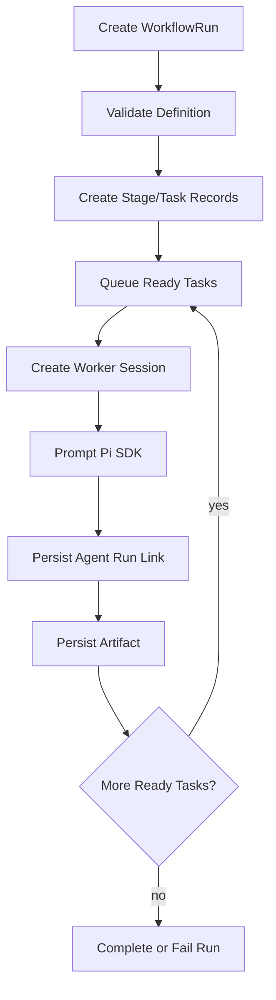

# Zuu Native Workflow 设计

> 状态：Implemented MVP
> 目标：把 workflow / subagent / DAG / board 做成 Zuu 原生能力，`@agwab/pi-workflow` 仅作为可选 adapter。

## 1. 背景

`@agwab/pi-workflow` 提供了成熟的 workflow、subagent、DAG 和 board 能力，但它不支持原生 Windows。Zuu 的默认体验不能要求 Windows 用户切到 WSL2 才能使用编排功能，因此 V1 主线改为实现 `NativeWorkflowBackend`。

新的定位：

- **原生后端**：`native`，由 Zuu daemon 自己保存 workflow definition、run、stage、task 和 artifact，可通过 `ZUU_WORKFLOW_BACKEND=native` 启用；启动请求返回 running run，runner 在后台推进 stage/task 状态。
- **可选后端**：`pi-package`，在 macOS/Linux/WSL2 中桥接第三方 Pi Package。
- **稳定协议**：WebUI 和 `@zuu/client` 只理解 Zuu DTO，不依赖第三方 package 的内部存储格式。

## 2. 设计原则

1. **先可用，后完整**：先做真实可运行的 `single`、`sequence` 和基础 DAG，不复刻完整第三方 workflow DSL。
2. **Zuu 是真相源**：definition、run、stage、task、artifact、abort 和 retry 状态由 Zuu JSON store 和项目定义文件持久化。
3. **Subagent 先做逻辑隔离**：第一版不强制外部子进程；每个 task 可以创建独立 `AgentSessionRuntime` 作为 worker。
4. **Board 来自协议数据**：WebUI board 只读取 `/v1/workflow-runs/*`、stage、task 和 artifact API。
5. **Adapter 可替换**：`native` 和 `pi-package` 共用 `WorkflowBackend` 接口，但不互相兼容内部数据。
6. **不做旧数据兼容层**：结构变化时直接迁移当前实现和文档，不保留旧 workflow store 适配。

## 3. MVP 范围

### 3.1 Workflow Definition

MVP 支持内置定义和项目级定义。项目级定义放在 Project cwd 的 `.zuu/workflows/*.json`，同 id 的项目定义覆盖内置定义。当前支持三种定义形态：

```ts
type NativeWorkflowDefinition =
  | SingleWorkflowDefinition
  | SequenceWorkflowDefinition
  | DagWorkflowDefinition;
```

- `single`：一个 task，适合模型 smoke、一次性 review、定时 prompt。
- `sequence`：多个 task 串行执行，上一 task artifact 可注入下一 task。
- `dag`：每个 task 声明 `dependsOn`，依赖完成后进入 ready 队列。

暂不支持：

- `foreach`
- `reduce`
- `loop`
- dynamic controller code
- 跨机器 worker
- 自动从第三方 `.pi/workflows` 格式导入

项目定义示例：

```json
{
  "id": "custom-review",
  "name": "Custom Review",
  "description": "Run two project-specific review tasks.",
  "kind": "sequence",
  "steps": [
    { "id": "inspect", "name": "Inspect", "prompt": "Inspect the project." },
    { "id": "summarize", "name": "Summarize", "prompt": "Summarize upstream artifacts.", "dependsOn": ["inspect"] }
  ]
}
```

### 3.2 Workflow Run

`WorkflowRun` 是一次 workflow 执行的顶层记录：

- `queued`：已创建，等待 runner 调度。
- `running`：至少一个 stage 或 task 正在执行。
- `completed`：所有必要 task 完成。
- `failed`：不可恢复错误或必须完成的 task 失败。
- `aborted`：用户或 schedule abort。

Run 必须记录：

- `projectId`
- `workflowId`
- `prompt`
- `status`
- `startedAt`
- `finishedAt`
- `stageIds`
- `taskIds`
- `artifactIds`
- `linkedRunIds`，用于关联底层 Agent Run。

### 3.3 Stage 与 Task

Stage 是 board 的展示层分组，Task 是实际执行单元。MVP 可以让每个 workflow step 同时拥有一个 stage 和一个 task，后续再允许一个 stage 内包含多个并发 task。

Task 必须记录：

- `id`
- `stageId`
- `status`
- `dependsOn`
- `agentRunId`
- `sessionId`
- `startedAt`
- `finishedAt`
- `attempts`
- `error`
- `artifactIds`

### 3.4 Artifact

Artifact 是 task 输出和跨 task 传递的唯一稳定载体。MVP 支持：

- `text`
- `json`
- `markdown`

Artifact 内容可以先存放在 workflow store 中；当内容变大时再拆到 `.zuu/pi-agent/artifacts/`，并在记录里保存路径和摘要。

## 4. Runner 行为

### 4.1 执行流程



### 4.2 Worker Session

MVP 的 subagent 是逻辑 subagent：

- 每个 task 使用独立 session/runtime，避免污染主交互 session。
- 默认 cwd 来自 project。
- 默认工具集比交互式 session 更窄。
- task prompt 中可以注入上游 artifact 摘要。
- task 结束后可 dispose runtime，但 session 文件和 Agent Run 记录保留。

后续如果需要更强隔离，再扩展为外部进程、worktree 或容器 worker。

### 4.3 DAG 调度

MVP DAG 规则：

- 启动前检查 task id 唯一。
- 启动前检查 `dependsOn` 指向存在。
- 启动前检查环。
- ready task 按定义顺序入队。
- 并发数默认 2，项目级可配置，绝不无限 fan-out。
- 必需 task 失败时，依赖它的下游 task 标记为 skipped 或 blocked，顶层 run 失败。

## 5. API 与 WebUI

现有 `/v1/workflows`、`/v1/workflow-runs`、stage、task、artifact 和 abort API 保持不变。新增或调整字段时优先扩展 DTO，不新增平行协议。

WebUI board 的下一步目标：

- run 列表展示 native/pi-package/fake backend。
- run 详情展示 stage 和 task 状态。
- task 详情展示 prompt、agent run、错误和 artifact。
- artifact 支持 markdown/json/text 预览。
- abort 按 run 传播到底层 active task 和 Agent Run。

## 6. 实施顺序

1. 增加 `native` workflow backend 类型和诊断信息。已完成。
2. 建立 native workflow store，保存 definition、run、stage、task、artifact。已完成。
3. 实现 `single` runner，并用 Pi SDK worker session 产生真实 Agent Run。已完成。
4. 实现 `sequence` runner，支持上游 artifact 注入。已完成。
5. 实现基础 DAG 校验和并发调度。已完成。
6. 将 scheduler workflow action 默认指向 native backend。已具备后端能力，仍由当前 `ZUU_WORKFLOW_BACKEND` 选择。
7. 后台 runner：启动请求快速返回，任务在后台推进并持久化状态。已完成。
8. 项目级 `.zuu/workflows/*.json` 定义加载。已完成。
9. 底层 Agent Run best-effort abort。已完成。
10. 升级 WebUI Workflow Runs 面板为真正 board。后续增强。
11. 再决定是否保留 `fake` 作为测试后端或用 native test fixture 取代。后续决策。

## 7. 与 `pi-package` 的关系

`pi-package` 不再是默认主线。它仍有价值：

- Linux/WSL2 用户可以使用成熟的第三方 workflow。
- 可作为 Zuu adapter 设计的对照实现。
- 可用于比较 native backend 的能力缺口。

但 Zuu V1 不再把 `@agwab/pi-workflow` 是否可运行作为 workflow/subagent 能力完成的前置条件。
