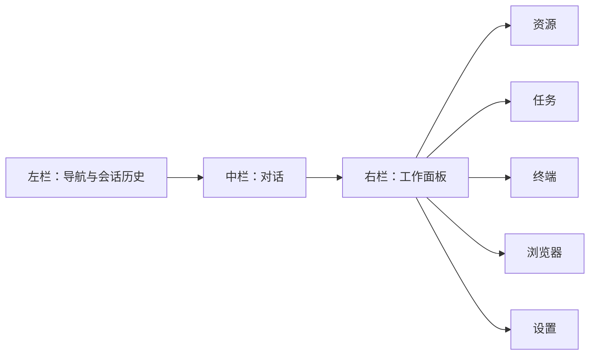

# WebUI 工作台重设计

## 目标

Zuu WebUI 不再按功能块随意堆叠，而是采用成熟 agent 产品常见的三栏工作台布局：

- 左侧：主导航、项目入口、会话历史。
- 中间：当前会话对话流、模型与运行状态、Prompt 输入。
- 右侧：可切换的工作面板，承载资源、子任务、终端、浏览器和设置。

左右栏都必须可以收起。设置属于二级功能，不占主路径。

## 信息架构

## 布局原则

- 主屏第一优先级是“继续对话”，不是配置项。
- 左栏只保留选择上下文需要的信息：项目、会话、最近运行。
- 右栏承载上下文工具：资源诊断、workflow/schedule 状态、event/terminal/browser、设置。
- 表单密度要高，但每个 panel 只放同类任务。
- 所有主要操作保留原能力，先重排，再逐步拆组件。

## 组件策略

- 使用 `components/ui` 里的 Button、Badge、Tabs、Textarea。
- 使用 `components/ai-elements` 里的 Terminal、WebPreview。
- 业务状态继续复用 `web/src/lib/panels/*` composables。
- 后续再把左栏、聊天区、右栏 panel 拆到 `web/src/components/workbench/`，每个目录保留 `index.ts`。

## 第一阶段验收

- WebUI 首屏为三栏工作台。
- 左侧和右侧可以收起。
- 设置、包管理、审计、模型 smoke test 等进入右侧 Settings。
- Workflow 与 Schedule 状态进入右侧 Tasks。
- Event stream 进入右侧 Terminal。
- 浏览器 preview 进入右侧 Browser。
- `pnpm check` 通过。
